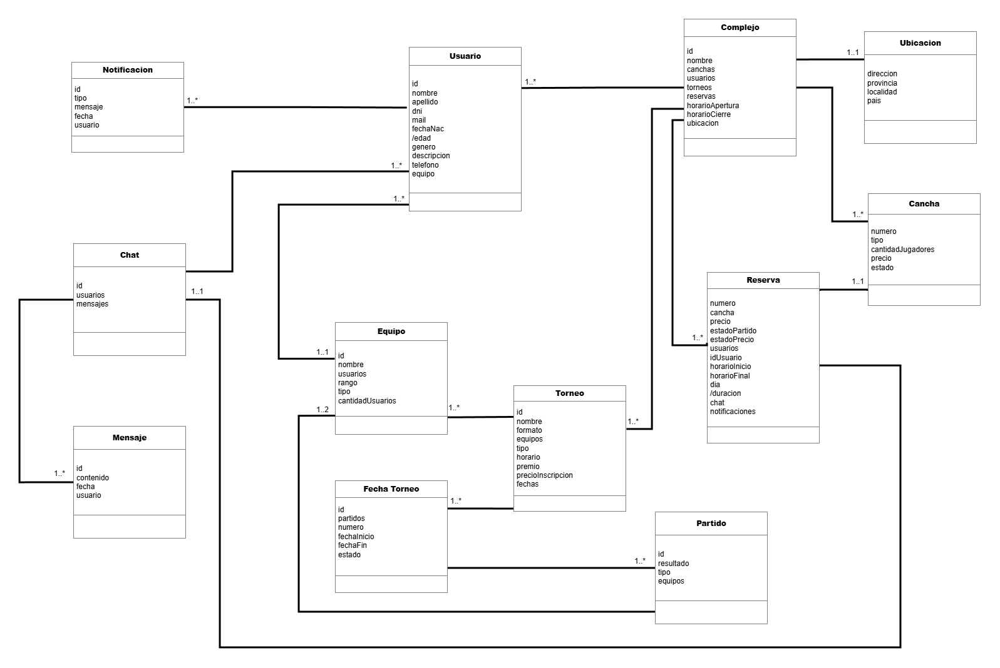

# Propuesta TP DSW

## Grupo
### Integrantes
* 54326 Doino, Roque
* 54327 Gallina, Santino Lucio
* 54689 Villa, Juan Pablo

### Repositorios
* [frontend app](http://hyperlinkToGihubOrGitlab)
* [backend app](http://hyperlinkToGihubOrGitlab)

## Tema
### Descripción
*Doble Cinco es una aplicación para la gestión de un complejo de fútbol que permite a los usuarios reservar canchas. Además, proporciona la búsqueda de partidos, conectando jugadores sin equipo con otros usuarios o equipos completos. La plataforma ofrece herramientas para la creación y organización de torneos.*

### Modelo

## Alcance Funcional 

### Alcance Mínimo

Regularidad:
|Req|Detalle|
|:-|:-|
|CRUD simple|1. CRUD Usuario 2. CRUD Cancha 3. CRUD Equipo|
|CRUD dependiente|1. CRUD Fecha Torneo {depende de} CRUD Torneo 2. CRUD Torneo {depende de} CRUD Complejo y CRUD Equipo|
|Listado + detalle| 1. Listado de canchas filtrado por tipo y disponibilidad, muestra nombre del complejo, tipo y precio ⇒ detalle CRUD Cancha  2. Listado de reservas filtrado por estado y fecha, muestra cancha, horario y estado de pago, nombre del usuario que reservo ⇒ detalle muestra datos completos de la reserva y usuario|
|CUU/Epic|1. Reservar cancha para un partido 2. Encontrar un partido con falta de jugadores|

Adicionales para Aprobación
|Req|Detalle|
|:-|:-|
|CRUD |1. CRUD Usuario 2. CRUD Complejo 3. CRUD Equipo 4. CRUD Cancha 5. CRUD Reserva 6. CRUD Partido 7. CRUD Torneo 8. CRUD Fecha Torneo 9. CRUD Notificacion|
|CUU/Epic|1. Reservar cancha para un partido 2. Encontrar un partido con falta de jugadores 3. Inscribir equipos a torneo 4. Registrar resultado de los partidos|

### Alcance Adicional Voluntario

*Nota*: El Alcance Adicional Voluntario es opcional, pero ayuda a que la funcionalidad del sistema esté completa y será considerado en la nota en función de su complejidad y esfuerzo.

|Req|Detalle|
|:-|:-|
|Listados |1. Listado de torneos filtrado por estado y tipo, muestra nombre, complejo, fecha de inicio y fecha de fin ⇒ detalle muestra datos completos del torneo, equipos inscriptos y fechas.  2. Listado de equipos filtrado por torneo, muestra nombre del equipo, cantidad de jugadores y rango ⇒ detalle muestra integrantes del equipo y partidos jugados en el torneo. 3. Listado de equipos ordenado por puntaje dentro de un torneo, filtrado por torneo y fecha, muestra nombre del equipo, partidos ganados, perdidos y puntos ⇒ detalle muestra el historial de partidos del equipo en ese torneo.|
|CUU/Epic|1. Cancelación de reserva|
|Otros|1. Envío de recordatorio de reserva por email 2. Notificacion cuando se encuentre un partido por email |

