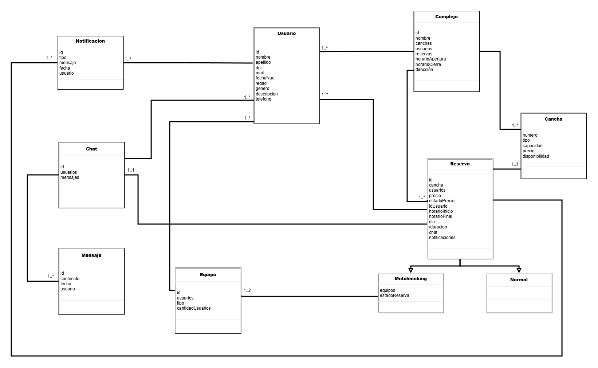

# Propuesta TP DSW

## Grupo
### Integrantes
* 54326 Doino, Roque
* 54689 Villa, Juan Pablo

### Repositorios
* [frontend app](http://hyperlinkToGihubOrGitlab)
* [backend app](http://hyperlinkToGihubOrGitlab)

## Tema
### Descripción
*Doble Cinco es una aplicación para la gestión de un complejo de fútbol que permite a los usuarios reservar canchas. Además, proporciona la búsqueda de partidos, conectando jugadores sin equipo con otros usuarios o equipos completos.*

### Modelo

## Alcance Funcional 

### Alcance Mínimo

Regularidad:
|Req|Detalle|
|:-|:-|
|CRUD simple|1. CRUD Usuario 2. CRUD Complejo |
|CRUD dependiente|1. CRUD Cancha {depende de} CRUD Complejo |
|Listado + detalle| 1. Listado de canchas filtrado por tipo y disponibilidad, muestra nombre del complejo, tipo y precio ⇒ detalle CRUD Cancha |
|CUU/Epic|1. Reservar cancha para un partido |

Adicionales para Aprobación
|Req|Detalle|
|:-|:-|
|CRUD |1. CRUD Usuario 2. CRUD Complejo 3. CRUD Equipo 4. CRUD Cancha  5. CRUD Complejo |
|CUU/Epic|1. Reservar cancha para un partido 2. Completar el equipo de una reserva de matchmaking |

### Alcance Adicional Voluntario

*Nota*: El Alcance Adicional Voluntario es opcional, pero ayuda a que la funcionalidad del sistema esté completa y será considerado en la nota en función de su complejidad y esfuerzo.

|Req|Detalle|
|:-|:-|
|Listados |1. Listado de usuarios del equipo de matchmaking, muestra nombre, id y descripción por usuario|
|CUU/Epic|1. Cancelación de reserva   2. Moderación del chat|
|Otros|1. Envío de recordatorio de reserva por email 2. Notificacion cuando se encuentre un partido por email |

